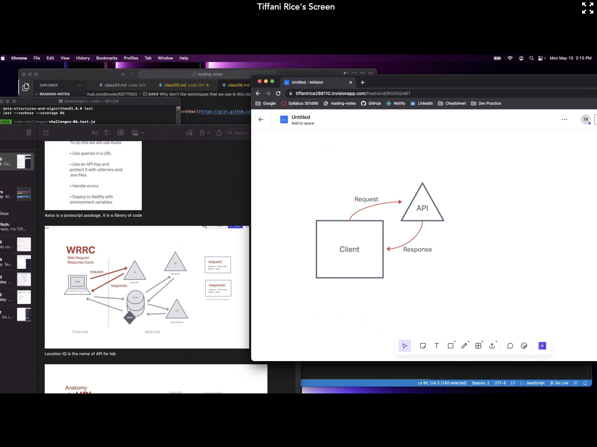

# city-explorer

**Author**: Ashley Taylor
**Version**: Lab 06

## Overview

- Lab 06

- Nellify: https://city-explorer-at.netlify.app

## Getting Started

- 

## Architecture

- Used to react.js to build a site that will show grids and a map of a city that a user inputs.

## Change Log

- Lab 06; added map, added lat & lon

## Credit and Collaborations

Sheyna Watkins Class 301 Day 06, 07, 08 Class Recording; Jared Ciccarello; Tiffani Rice;

Name of feature: Lab 06

Estimate of time needed to complete: 5 hrs

Start time: 10:30/4:40/7:45
Stopped working: 3:02/6:45/10:45

Finish time: 10:45

Actual time needed to complete: 9.5 hrs
